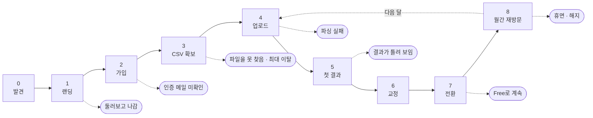
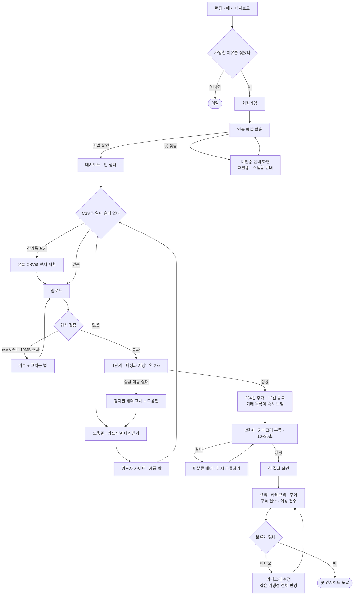
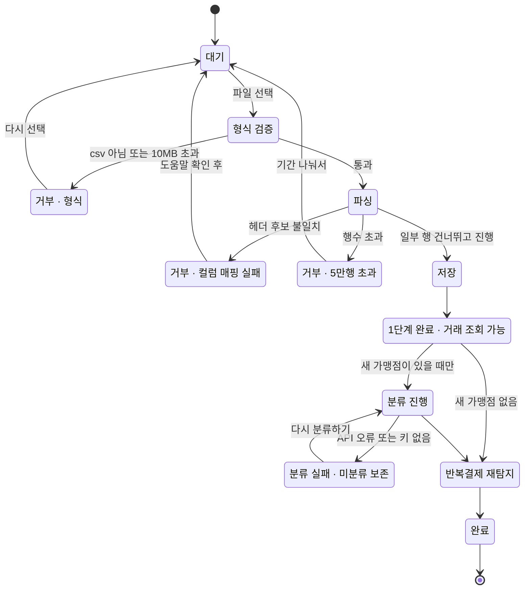
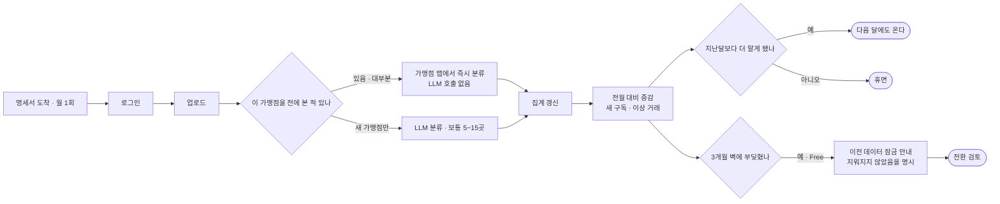
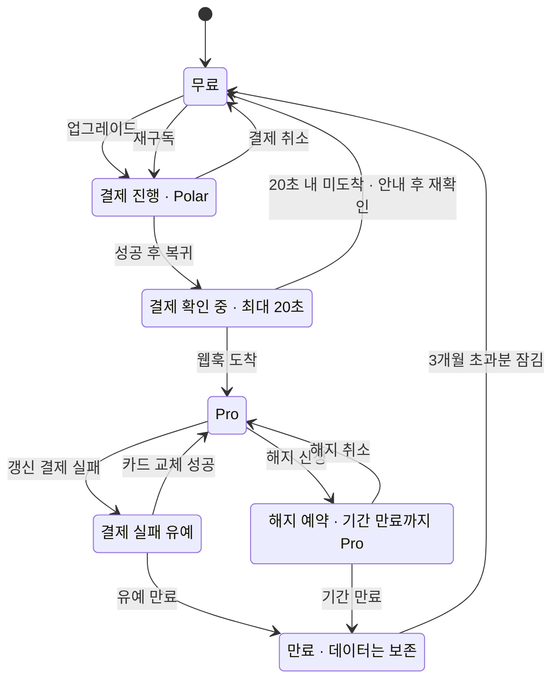
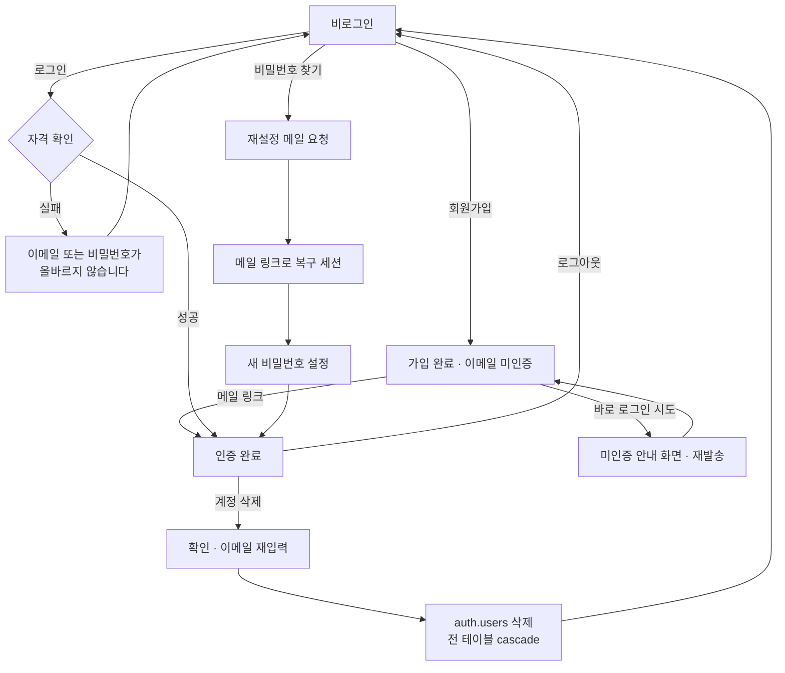

# FinSight 사용자 여정 설계

1차 계획은 *무엇을 만드는가*를 정했다. 이 문서는 관점을 돌려 **사람이 실제로 어떤 순서로 화면을 지나가는가**를
끝까지 밟아본 결과다. 그 과정에서 지금 플랜이 사용자를 세워두고 다음으로 못 가게 만드는 지점 12곳이 나왔다.

이 문서는 `docs/`가 아니라 `phases/`에 있다. `scripts/execute.py:184`가 `docs/*.md`를 전 step 프롬프트에
주입하므로, 다이어그램까지 12번 주입되는 것을 피하기 위해서다. 이 문서가 필요한 step은 "읽어야 할 파일"에
경로가 명시되어 있다.

---

## 1. 이번 개정에서 바뀐 것

기능 목록은 그대로다. 바뀐 것은 **기능 사이의 빈틈**이다.

| | 결정 | 이유 |
|---|---|---|
| **A** | **업로드를 2단계로 분리** — ①저장(즉시 응답) → ②분류(별도 호출) | 분류에 10~30초가 든다. 한 요청으로 묶으면 실패했을 때 파싱 결과까지 함께 날아가고 재시도할 방법이 없다. 나눠두면 거래는 이미 저장돼 있고 분류만 다시 돌린다. **타임아웃 때문이 아니다** — 아래 각주 참조 |
| **B** | **`merchant_categories` 테이블 신설** (7번째 테이블) | 매달 같은 가맹점이 다시 미분류로 들어와 LLM에 재전송된다. 사용자별 가맹점→카테고리 맵을 두면 2회차부터 *새 가맹점만* 보낸다. 동시에 "한 번 고치면 전부 반영"과 "수정이 다음 달에도 유지"가 따라온다 |
| **C** | **Pro 게이팅을 목록 단위로 낮춤** — 건수·총액은 Free, 목록은 Pro | "뭐가 빠져나가는지 모르겠다"가 유입 동기인 사용자에게 구독 탐지를 통째로 잠그면 첫 방문에 가치를 하나도 못 본 채 떠난다. *실제로 계산한* 요약 수치는 보여주고 세부 목록만 잠근다. 가짜 데이터가 아니라 진짜 결과의 요약이다 |
| **D** | **히어로 숫자를 "이번 달"에서 "최근 명세서 기간"으로** | 명세서는 지난달 것이 이번 달에 나온다. 7월에 6월 명세서를 올린 사용자의 "이번 달 총지출"은 ₩0이다. 첫 화면이 0원이면 앱이 고장 난 것으로 보인다 |
| **E** | **도움말 `/help/csv` 신설** — 카드사별 내려받기 경로 | 가입과 업로드 사이에 우리 제품 밖의 관문이 있다. 카드사 사이트에서 CSV를 찾는 일이다. 전 여정에서 이탈이 가장 큰 지점인데 1차 플랜에는 화면이 아예 없었다 |

> **타임아웃에 대한 정정.** 결정 A를 처음에는 Vercel 함수 타임아웃 문제로 의심했으나, 확인 결과 fluid compute
> 기준 **기본 300초**(Hobby 최대 300s, Pro 800s)라 30초짜리 동기 요청은 죽지 않는다. 분리의 근거는 타임아웃이
> 아니라 **실패 복구와 체감 속도**다. 다만 Vercel 문서가 별도로 경고하는 항목이 있다 — 응답이 idle인 채 오래
> 열려 있으면 HTTP/1.1 경로의 중간 네트워크가 연결을 끊을 수 있으니 진행 데이터를 흘려보내라는 것. 2단계 분리는
> 이것도 함께 피한다.

---

## 2. 막다른 길 원장

여정에서 **사용자가 다음으로 갈 곳이 없어지는** 지점만 모았다. 기능이 없는 것과 길이 끊긴 것은 다르다.
아래는 전부 후자다 — 새 기능이 아니라, 이미 있는 기능들 사이가 이어지지 않는 곳이다.

| 코드 | 사용자가 멈추는 지점 | 그때 화면에 없는 것 | 수정 |
|---|---|---|---|
| **DE-01** | 비밀번호를 잊음 | 재설정 경로 자체가 없음. 로그인 화면이 종점 | step 4 — `/auth/reset` 요청·확정 2화면 |
| **DE-02** | 가입했는데 인증 메일을 못 찾음 | 다시 로그인하면 원인 불명 실패로만 보임 | step 4 — 미인증 전용 안내 + 재발송 |
| **DE-03** | CSV를 어디서 받는지 모름 | 빈 대시보드에 업로드 박스만 있음 | step 10 — `/help/csv`, 빈 상태에서 링크 |
| **DE-04** | 컬럼명이 후보에 없는 CSV | 한국어 에러 한 줄. 그래서 뭘 해야 하는지가 없음 | step 2·8 — 감지된 헤더 표시 + 도움말 유도 |
| **DE-05** | LLM 분류가 실패함 | 거래는 영구 미분류. 재시도 버튼 없음 | step 7 — 분류 전용 라우트 + 재분류 액션 |
| **DE-06** | 카테고리 하나를 고침 | 같은 가맹점 나머지 40건은 그대로 | step 7 — 가맹점 단위 반영 + 맵 저장 |
| **DE-07** | 결제하고 돌아왔는데 아직 잠김 | 웹훅이 리다이렉트보다 먼저 온다는 보장이 없음 | step 8·9 — 확인 대기 화면 + 짧은 폴링 |
| **DE-08** | 갱신 결제 실패 | `past_due`가 타입에만 있고 동작이 정의 안 됨 | step 9 — 유예 기간 + 배너 |
| **DE-09** | 그만 쓰고 데이터를 지우고 싶음 | 계정 삭제 경로 없음. 거래 원문은 계속 남음 | step 4 — `DELETE /api/account` |
| **DE-10** | 지난달 명세서를 올림 | "이번 달 총지출 ₩0"이 첫 화면 | step 8 — 기준을 최근 명세서 기간으로 |
| **DE-11** | 2회차 업로드 | 지난달에 분류한 가맹점을 또 LLM에 보냄 | step 3·7 — `merchant_categories` |
| **DE-12** | 업로드 후 30초 동안 아무 표시 없음 | 진행 상태도, 중간 저장도 없음 | step 7·8 — 2단계 분리 + 단계별 문구 |
| **DE-13** | 엉뚱한 파일을 올림 | 명세서를 지울 방법이 없음. 탈출구가 계정 삭제뿐 | step 7·8 — `DELETE /api/statements/[id]` |

> DE-13은 여정 1차 검토에서 놓쳤다가 보안·에러 케이스 리뷰에서 나왔다. 되돌리기 경로는 여정을 순방향으로만 밟으면 잘 보이지 않는다.

---

## 3. 세 사람

PRD의 "개인과 프리랜서"를 실제로 다르게 움직이는 세 사람으로 쪼갰다. **이탈 지점이 셋 다 다르고**,
그래서 각각 다른 화면이 필요하다.

| | **지수** 32·회사원·카드 1장 | **민호** 38·프리랜서·카드 3장+계좌 1개 | **서연** 27·사회초년생·카드 2장 |
|---|---|---|---|
| 계기 | 월급날 잔고를 보고 놀람 | 종합소득세 경비 정리 | "뭔가 계속 빠져나가는데 뭔지 모르겠다" |
| 원하는 것 | 어디에 썼는지 한 화면 | 반복 결제 파악, 전 기간 내보내기 | 구독 목록 하나 |
| 주기 | 월 1회, 5분 | 월 1회에 파일 4개 연속 업로드 | 문제가 풀리면 떠날 수 있는 1회성 |
| 이탈 지점 | CSV를 못 찾음 (DE-03) | 4개 파일이 한 대시보드에 섞임 | 구독 탐지가 통째로 Pro라 첫 방문에 아무것도 못 봄 |
| 전환 가능성 | 낮음. 4개월째 추이가 잘려 아쉬워지는 유형 | 가장 높음. 전 기간 + 내보내기가 곧 결제 이유 | 동기는 최고, 신뢰는 최저. 이 조합이 결정 C를 만들었다 |

> **민호에 대한 솔직한 한계.** 카드별·용도별(사업/개인) 구분은 이번 MVP에 넣지 않는다. 태그 모델과 필터 UI가
> 따라붙어 범위가 커진다. 대신 `statements.source_hint`로 어느 파일에서 온 거래인지는 추적되게 두고, 랜딩과
> 도움말에서 **"카드별 구분은 아직 지원하지 않습니다"**를 명시한다. 기대를 만들어놓고 배신하는 것보다 낫다.

---

## 4. 여정 지도

9단계. 실선은 진행, 점선은 이탈이다. **3단계가 우리 제품 밖에 있다**는 것이 이 지도의 요점이다 —
사용자는 카드사 사이트로 나갔다가 파일을 들고 돌아와야 한다. 그 왕복을 우리가 돕지 않으면 가입까지의
노력이 전부 버려진다.

---

## 5. 첫 방문에서 첫 인사이트까지

제품의 승패가 갈리는 구간이다. 가입 버튼을 누른 사람이 **자기 돈에 대한 첫 문장**을 읽기까지 지나는
분기를 전부 펼쳤다.

### 구간별 이탈 원인과 대응

| 구간 | 왜 떠나는가 | 대응 |
|---|---|---|
| 랜딩 → 가입 | 내 데이터가 어디로 가는지 모르는 채 금융 정보를 맡기라는 요구 | 히어로 아래 개인정보 문단. 가맹점명이 Anthropic으로 나가는 사실을 숨기지 않는다 |
| 가입 → 인증 | 메일이 스팸함에 있거나, 나중에 하려다 잊음 | 미인증 상태 전용 화면. "로그인 실패"로 뭉뚱그리지 않는다 |
| 인증 → CSV | 카드사에서 CSV 받는 법을 모름. **여기가 가장 크다** | 도움말 + 빈 대시보드에서 바로 링크 + 샘플 CSV 즉시 체험 |
| CSV → 업로드 | 엑셀 파일이거나 PDF만 받아짐 | 거부 메시지에 *고치는 법*을 넣는다. PDF 미지원 명시 |
| 업로드 → 결과 | 30초 무반응. 실패하면 처음부터 다시 | 2단계 분리. 1단계가 끝나면 거래 목록이 이미 보인다 |
| 결과 → 신뢰 | 분류 몇 개가 눈에 띄게 틀림 → 전체를 못 믿음 | 수정이 같은 가맹점 전체에 즉시 반영. 한 번 고치면 눈에 보이게 달라진다 |

---

## 6. 업로드 상태 머신

업로드는 화면 하나가 아니라 **상태 열둘**이다. 각 상태에 문구가 정해져 있지 않으면 구현하는 쪽이 그때그때
지어내게 되고, 그러면 앱 전체의 말투가 무너진다.

### 상태별 화면 문구 — 이 표가 그대로 구현 사양이다

| 상태 | 화면에 나오는 말 | 사용자가 할 수 있는 것 |
|---|---|---|
| 대기 | `CSV 파일을 끌어다 놓거나 선택하세요` | 파일 선택 · 샘플 받기 · 도움말 |
| 거부 · 형식 | `CSV 파일만 올릴 수 있습니다. 엑셀 파일은 "다른 이름으로 저장 → CSV UTF-8"로 바꿔주세요.` | 다시 선택 · 도움말 |
| 거부 · 크기 | `파일이 너무 큽니다. 10MB 이하로 올려주세요.` | 다시 선택 |
| 파싱 | `파일을 읽는 중…` | — |
| 거부 · 컬럼 | `거래일자·적요·금액 컬럼을 찾지 못했습니다. 이 파일의 첫 줄은 [감지된 헤더]입니다.` | 도움말 · 다시 선택 |
| 거부 · 행수 | `거래가 5만 건을 넘습니다. 기간을 나눠 올려주세요.` | 다시 선택 |
| 저장 | `거래를 저장하는 중…` | — |
| 1단계 완료 | `234건 추가 · 12건 중복 · 3건 건너뜀` | 거래 목록 보기 · 건너뛴 행 확인 |
| 분류 진행 | `새 가맹점 28곳을 분류하는 중…` | 기다리거나 나가도 됨 |
| 분류 실패 | `카테고리 분류에 실패했습니다. 거래는 모두 저장되어 있습니다.` | **다시 분류하기** |
| 완료 | `완료. 6월 지출 ₩2,340,900` | 대시보드로 |

> **건너뛴 행.** `skippedRows`는 파서가 이미 행 번호와 한국어 사유를 모으고 있는데 1차 플랜에는 화면에 노출할
> 자리가 없었다. 조용히 3건이 사라지는 것과 "3건 건너뜀 · 어느 행인지 보기"는 신뢰에서 완전히 다르다.
> 접힌 목록으로 노출한다.

---

## 7. 월간 재방문 루프

이 제품은 **월 1회 5분** 쓰인다. 진짜 승부는 2회차다. 1회차는 호기심으로 오지만 2회차는 지난달에 얻은 게
있어야 온다.

| 회차 | LLM에 보내는 가맹점 | 체감 대기 | 사용자가 새로 얻는 것 |
|---|---|---|---|
| 1회차 | 전부 (60~90곳) | 20~30초 | 지출 구조 · 카테고리 비중 |
| 2회차 | 새 가맹점만 (5~15곳) | 5~10초 | **전월 대비 증감** · 반복 결제 후보 |
| 3회차 | 새 가맹점만 | 5~10초 | **반복 결제 확정** (3회 이상 조건 충족) |
| 4회차 | 새 가맹점만 | 5~10초 | Free는 여기서 3개월 벽 — 전환 시점 |

> **설계가 맞물리는 지점.** 반복 결제는 **3회 이상**이라야 탐지된다. 즉 서연이 원하는 "구독 목록"은 3회차
> 방문에야 완성된다. 1회차에 아무것도 못 보여주면 3회차는 오지 않는다. 그래서 1회차부터 *후보 건수와 총액*은
> 보여주고, 회차가 쌓이며 정확해진다고 말한다. 이것이 결정 C의 근거이자, 이 제품이 **누적형**이라는 사실을
> 사용자에게 가르치는 방법이다.

---

## 8. 결제와 구독 상태

돈이 오가는 구간은 실패 경로가 성공 경로보다 많다. 특히 **결제 성공과 웹훅 도착 사이의 몇 초**가 위험하다 —
방금 돈을 낸 사람이 잠긴 화면을 보는 순간이기 때문이다.

| 상태 | 화면 | Pro 기능 | 구현 위치 |
|---|---|---|---|
| 확인 중 | `결제를 확인하고 있습니다. 잠시만 기다려주세요.` | 대기 | step 8 — `?upgraded=1`에서 짧은 폴링 |
| 확인 실패 | `결제는 완료되었지만 반영이 늦어지고 있습니다. 잠시 후 새로고침하거나 구독 관리에서 확인해주세요.` | 대기 | step 8 — 포털 링크 동반. **실패로 표시하지 않는다** |
| 유예 | `결제가 처리되지 않았습니다. 2026-08-05까지 Pro 기능을 계속 쓸 수 있습니다.` | 유지 | step 9 — `past_due` + 기간 |
| 해지 예약 | `2026-08-27까지 Pro 기능을 쓸 수 있습니다.` | 유지 | step 9 — 즉시 강등 금지 |
| 만료 | `최근 3개월만 표시하고 있습니다. 이전 데이터는 삭제되지 않았습니다.` | 잠금 | step 8 — 삭제가 아님을 반드시 명시 |

### 전환 트리거는 어디에 두는가

업그레이드 버튼을 여기저기 뿌리는 대신 **사용자가 벽에 부딪힌 바로 그 자리**에만 둔다. 벽은 셋뿐이다.

1. **구독 목록을 열었을 때** — `반복 결제 12건, 월 ₩84,300`은 보이고 목록은 잠김
2. **이상 거래를 열었을 때** — `이상 거래 3건`은 보이고 상세는 잠김
3. **추이 차트가 3개월에서 잘릴 때** — 차트 위 안내와 함께

AI 인사이트는 네 번째 벽이 될 수 있지만 **일부러 만들지 않는다.** 인사이트는 위 세 결과를 근거로 쓰이는
글이라, 근거가 잠긴 상태에서 글만 파는 것은 순서가 거꾸로다.

---

## 9. 계정 상태

> **계정 삭제를 MVP에 넣는 이유.** ADR-007이 "데이터를 지우지 않는다"로 정해져 있고, ADR-005는 거래 원문을
> 전량 보관한다. 둘을 합치면 **떠난 사용자의 금융 거래 원문이 무기한 남는다.** 이건 기능 부족이 아니라 부채다.
> 삭제 경로는 `auth.users` 한 행을 지우면 cascade로 끝나므로 20줄 남짓이다. 넣는 쪽이 맞다.

---

## 10. 유스케이스 원장

30건. 각 행은 *사용자가 하는 일*과 *시스템이 반드시 하는 일*의 짝이다.

| 코드 | 상황 | 시스템이 하는 일 | 비고 |
|---|---|---|---|
| UC-01 | 랜딩에서 예시 대시보드만 보고 나감 | 예시임을 명시. 요금제·도움말을 히어로에서 바로 열 수 있게 | |
| UC-02 | 요금제만 보고 판단 | Free로 되는 것을 먼저 쓴다. 무제한 업로드를 양쪽에 명시 | |
| UC-03 | 인증 메일이 오지 않음 | 재발송 + 스팸함 안내 | DE-02 |
| UC-04 | 미인증 상태로 로그인 시도 | 전용 안내 화면. 자격 실패와 구분 | DE-02 |
| UC-05 | 비밀번호를 잊음 | 재설정 메일 → 복구 세션 → 새 비밀번호 | DE-01 |
| UC-06 | 다른 기기에서 로그인 | 세션 독립. 데이터는 동일 | |
| UC-07 | 카드사 사이트에서 CSV를 못 찾음 | 카드사별 내려받기 경로 도움말 | DE-03 |
| UC-08 | 엑셀 파일만 받아짐 | 거부 메시지에 CSV 저장 방법 포함 | DE-04 |
| UC-09 | PDF 명세서만 있음 | 미지원임을 도움말에 명시. OCR은 범위 밖 | DE-03 |
| UC-10 | 내 파일 없이 먼저 써보고 싶음 | 샘플 CSV 내려받아 그대로 업로드 | DE-03 |
| UC-11 | CP949 인코딩 파일 | 자동 감지 후 재디코딩 | |
| UC-12 | 컬럼명이 후보에 없음 | 감지된 첫 줄을 그대로 보여주고 도움말로 유도 | DE-04 |
| UC-13 | 일부 행의 날짜가 깨짐 | 건너뛰고 계속. 건수와 행 번호를 화면에 노출 | 노출 추가 |
| UC-14 | 거래 5만 건 초과 | 기간을 나눠 올리라고 안내 | |
| UC-15 | 같은 파일을 또 올림 | 추가 0건 · 중복 N건. **성공으로 표시** | |
| UC-16 | 기간이 겹치는 다른 파일 | 겹친 거래만 지문으로 걸러짐 | |
| UC-17 | 분류 중 탭을 닫음 | 재방문 시 미분류 배너 + 이어서 분류 | DE-05 |
| UC-18 | LLM 키 없음 또는 한도 초과 | 거래는 보존. 미분류 상태로 두고 재시도 제공 | DE-05 |
| UC-19 | 모바일에서 업로드 | 드래그 없이 파일 선택으로도 완주 | |
| UC-20 | 카테고리가 틀림 | 수정 시 같은 가맹점 전체 반영. 다음 달에도 유지 | DE-06 |
| UC-21 | 이번 달 명세서가 아직 없음 | 히어로 기준을 최근 명세서 기간으로. 기간을 함께 표기 | DE-10 |
| UC-22 | 12개월치를 올렸는데 Free | 업로드 결과에서 즉시 "3개월만 표시" 안내. 삭제 아님을 명시 | 시점 이동 |
| UC-23 | 이상 거래가 사실 정상 거래 | **이번 범위 아님.** 12장 참조 | 보류 |
| UC-24 | 끊긴 구독을 발견 | 해지 방법은 우리가 모름. 가맹점명과 마지막 결제일만 정확히 | |
| UC-25 | Pro 기능을 열어봄 | 건수·총액은 표시, 목록은 잠금 | 결정 C |
| UC-26 | 결제 후 복귀했는데 아직 Free | 확인 대기 화면 + 짧은 폴링 + 포털 링크 | DE-07 |
| UC-27 | 갱신 결제 실패 | 유예 기간 배너. 기간 내 Pro 유지 | DE-08 |
| UC-28 | 해지 | 기간 만료까지 Pro. 만료 후 초과분 잠금 | |
| UC-29 | 해지를 취소 | `onSubscriptionUncanceled` 처리 | 추가 |
| UC-30 | 계정과 데이터를 지우고 싶음 | 확인 후 cascade 삭제 | DE-09 |

---

## 11. 화면 × 상태 매트릭스

MVP가 무너지는 가장 흔한 방식은 기능이 없어서가 아니라 **모든 화면이 성공 경로 하나만 그려져 있어서**다.
각 화면이 반드시 처리해야 하는 상태를 못 박는다.

| 화면 | 비었을 때 | 부분적일 때 | 실패했을 때 | 권한이 없을 때 |
|---|---|---|---|---|
| 대시보드 | 업로드 안내 + 도움말 + 샘플 | 미분류 배너 + 다시 분류 | 집계 실패 시 원본 거래 목록으로 폴백 | — |
| 카테고리 차트 | 거래 없음 안내 | 미분류분을 기타에 합치되 별도 표기 | 표 보기로 폴백 | — |
| 추이 차트 | 1개월치뿐이면 비교 대상 없음을 명시 | 빈 달을 0으로 채움 | 표 보기로 폴백 | Free는 3개월 경계선 + 안내 |
| 구독 목록 | 3회 이상 반복이 아직 없음을 설명 | 끊긴 구독을 하단 분리 | — | 건수·총액 표시 + 목록 잠금 |
| 이상 거래 | 이상 없음을 긍정으로 표현 | 표본 부족 카테고리는 판정 제외임을 명시 | — | 건수 표시 + 상세 잠금 |
| 인사이트 | 거래가 적어 아직 못 씀 | 캐시된 이전 결과 + 생성 시각 | 실패해도 다른 영역은 정상 표시 | 전체 잠금 |
| 거래 목록 | — | 카테고리 없음도 그대로 표시 | — | 보관 기간 밖은 목록에서 제외 + 안내 |
| 업로드 | 대기 문구 | 1단계 완료 후 2단계 진행 표시 | 상태별 거부 문구 + 고치는 법 | — |

---

## 12. 알면서 넣지 않은 것

여정에서 보였지만 이번에는 넣지 않았다. 모르고 빠진 것과 구분하기 위해 적어둔다.

- **카드별·용도별 구분** — 민호의 핵심 요구지만 태그 모델과 필터가 따라붙는다. 다음 사이클
- **수동 컬럼 매핑 UI** — DE-04를 완전히 없애려면 사용자가 직접 컬럼을 짝지어야 한다. 지금은 도움말로 대응하고, 실패 로그를 모아 후보 표를 늘리는 쪽이 싸다
- **예산·알림** — PRD 제외 그대로. 알림은 이 제품을 월 1회에서 상시로 바꾸는 큰 변화라 별도 판단이 필요하다
- **PDF·이미지 명세서** — OCR 범위 밖. 도움말에 명시만 한다
- **이상 거래 무시 처리 (UC-23)** — 같은 정상 거래가 매달 다시 이상으로 뜨면 목록 전체를 안 보게 된다. 다만 이건 길이 끊기는 문제가 아니라 성가심이고, 컬럼 하나 + 라우트 하나가 붙는다. **이번에 넣지 않은 것 중 가장 먼저 후회할 항목**으로 적어둔다 — MAD 임계값(3.5)이 실제 데이터에서 얼마나 많이 잡는지 보고 판단하는 편이 낫다
- **장기 미접속 데이터 정리** — 계정 삭제는 넣었지만 자동 정리 정책은 운영 데이터를 보고 정한다
